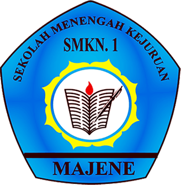

  

# E-Presensi & Sistem Terpadu UPTD SMKN 1 Majene

Selamat datang di **E-Presensi & Sistem Terpadu UPTD SMKN 1 Majene** – sebuah platform digital resmi untuk memanajemen kehadiran, aktivitas belajar mengajar, serta literasi di UPTD SMKN 1 Majene secara terpusat dan modern.

## 🚀 Fitur Utama

Aplikasi ini dibagi menjadi beberapa modul dan hak akses (role), yaitu:

### 1. Panel Siswa
- **Absensi Kehadiran:** Mencatat absensi kedatangan dan kepulangan menggunakan integrasi Geofencing.
- **Literasi Al-Qur'an:** Menambahkan dan melihat riwayat catatan literasi (hafalan/tajwid) harian.
- **Koleksi E-Book:** Akses interaktif ke perpustakaan digital (E-Book) sekolah. Siswa wajib menjawab kuis pemahaman materi agar progres membacanya meningkat.
- **Profil Siswa:** Manajemen profil terpusat (NIS, NISN, Kelas, Jurusan, dll).

### 2. Panel Guru
- **Absensi Kehadiran:** Sama halnya dengan siswa, guru dapat melakukan absensi datang dan pulang.
- **Absensi Mengajar:** Jurnal mengajar harian guru yang wajib difoto secara *live* menggunakan kamera langsung (tidak bisa mengunggah dari galeri) sebagai bukti sahih kehadiran di kelas.
- **Pemantauan Literasi Siswa:** Mengecek dan membaca catatan literasi Al-Qur'an siswa yang diajar.

### 3. Panel Kurikulum
- **Monitoring Mengajar:** Dasbor khusus bagi Waka Kurikulum untuk memantau jurnal mengajar guru secara real-time.
- **Verifikasi Mengajar:** Kurikulum dapat memverifikasi catatan mengajar setiap guru (dengan status Terverifikasi Mengajar / Tidak Mengajar) dan memberikan catatan verifikasi.

### 4. Panel Admin
- **Master Data:** Manajemen akun pengguna (Admin, Guru, Siswa, dan Kurikulum) serta profil siswa.
- **Manajemen Geofence:** Mengatur lokasi sekolah dan radius aman agar siswa hanya dapat absen jika berada di area sekolah.
- **Manajemen E-Book:** Mengelola data buku digital dan membuat kuis/pertanyaan untuk setiap buku bacaan.
- **Laporan Absensi:** Merekap data kehadiran siswa dan guru.

## 🛠️ Teknologi yang Digunakan
- **Framework:** Laravel 11.x
- **Frontend:** Laravel Blade, Tailwind CSS, Alpine.js
- **Database:** MySQL / MariaDB
- **Autentikasi:** Laravel Breeze

## 🛡️ Catatan Penting
- **Akses Kamera:** Karena aplikasi ini menggunakan kamera browser (*webRTC*) untuk absensi mengajar, pastikan server berjalan di `localhost` atau menggunakan protokol `https://` agar perizinan kamera berfungsi di browser (*security policy*).
- **Keamanan:** Jalur registrasi mandiri untuk publik (`/register`) telah dinonaktifkan demi alasan keamanan sekolah. Pembuatan akun sepenuhnya berada di tangan Admin.

## 🤝 Lisensi
Sistem ini bersifat hak cipta milik UPTD SMKN 1 Majene.
